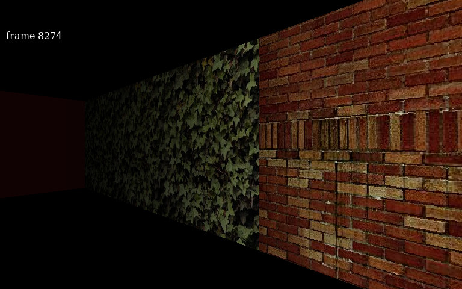

# Raycast

In October 2011, I felt like making a raycaster. This is it. Features:

- Software renderer
- Smooth lighting
- Load textures from JPEG
- Uses fixed-point math, no floats

## Building & Running

Only ever tested this on Linux. You need autotools, LibJPEG, LibSDL (version 1!), and PangoCairo. Once you have all that,

    $ autoreconf -i
    $ ./configure
    $ make
    $ ./src/run.sh

Use the arrow keys to move. You can also use a gamepad, but don’t expect many gamepads to be compatible. Tested with Logitech Rumblepad 2.

## License

This code is licensed under the MIT license. See LICENSE.txt for details.

The textures are available under the CC0 license. See data/LICENSE.txt for details.
